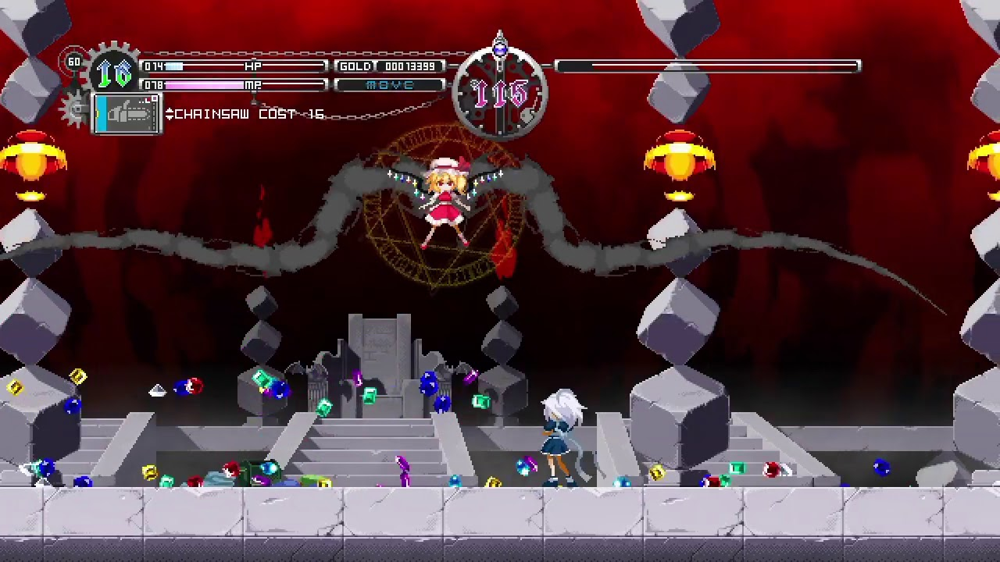
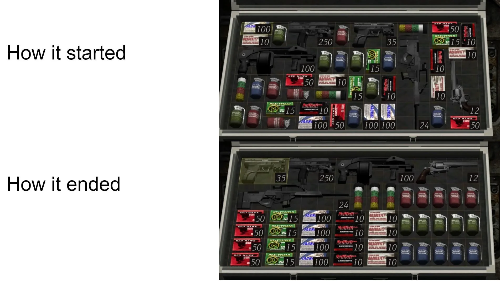

==========================================
Mouhou shoujo metroidvania design document
==========================================

documento

*******
Preface
*******

************
Game Concept
************

el consepto es una chica magica en un dungeon similar al
castillo de castlevania con el extra que sus armas son armas de fuego.

Introduction
============

introducion

Background
==========

background 

Description
===========

descripcioncion

************
Key Features
************

mouhou shoujo:
==============
	esplorar el genero del estilo como personajes y enemigos

graficos
========
	los graficos serian personajes 2d tanto el principal como los mobs
	los probs del escenario serian en 3d lowpoly para aprovechar la posibilidad
	de usar shader cambiar la visualizacion de las texturas

camara
======
	el estilo de la camara sera con perpectiva y side scroller similares a
	metroid

sonido
======
	aun pendiente

dificutad
=========
	dificultad artificial como en dark souls

******
genero
******
el genero es un metroidvania con mecanicas de gestion de recursos

******************
mecanica del juego
******************

core
====

seria la exploracion del dungeon adquiriendo herramientas para abrir nuevas
areas

el estilo de combate seria imitar a los shoters tacticos donde dispararia
hacia en frente para probocar danno a los enemigos

*********
game flow
*********

avanzar en el dungeon eliminando los enemigos para obtener recursos y poder
comprar mas municion en la tienda, al avanzar por el dungeon se encontrara
con salas de jefes que una vez derrotado podra adquirir la siguiente herramienta
que le permitira avanzar a nuevas areas del dungeon

* enememigos
* exploracion
* jefes
* obtencion de equipo

**********
personajes
**********

personaje principal
===================
el personaje principal es una mouhou shoujo que se por razones termino haciendo
un trato con la mascota al darle poderes resultaron ser del nabo y ahora
tiene que crusar el dungeon usando armas de fuego ya que sus poderes no sirven
para el combate

mascota
=======
la mascota de la mouhou shoujo no tiene nada de especial y es incapas de dar
buenas habilidades a sus mouhou shoujo

vendedor del dungeon
====================
ente que recolecta la magia de los mobs muertos para su subsistir, suele vender
articulos mouhou shoujo que entran en el dungeon, el le entrega su primer arma
al personaje principal para que tenga una posibilidad de completar el dungeon
e intercambia la magia recolectada y otras basuras del dungeon por municiones
y otras herramientas

****
mobs
****

zombie
======
mob basico, solo se mueve en horizontal a una velociadad promedio, su medio de
ataque es colicionar con el player, nesesita 10 golpes para matar al personaje.
punto debil: cabeza

caballero
=========
upgrade del zombie con la diferencia que si se acerca al personaje efectuara
un ataque con mas alcance nesesita 5 de esos para matar al player
punto debil: pecho

hada
====
serian el equibalente de las medusas, se mueven por rupas establecidas
nesesita 20 impactos para matar al player

*****
jefes
*****

biblotecaria
============
una mouhou shoujo que se quedo en la bibloteca del dungeon, es la responsable
de la creacion de los zombies,

su modo de ataque es debil pero tiene una solida defensa

su barrera se comforma de varias partes que orbitan en esfera alrededor de ella
cada parte tiene su propio HP y no se regeneran
el truco para vencerla es atacar al mismo fragmento para romperlo y dando un
ataque, al ser una mouhou shoujo no es muy resistente a los balas y moriria
de una rafaga

*****
armas
*****

pistola
=======
arma basica que le entrega el vendedor por lastima y beneficiarce el personaje
principal

subfusil
========
el vendeedor lo vende a un modico precio, seria el upgrade de la pistola
con la desventaja que usa mas municion y nesesita mas espacio en el inventario

escopeta
========
esta arma la obtendria despues de vencer al primer jefe, tiene la capacidad
de romper las puertas cerradas y disparar multiples projectiles o de elementos

fusil de asalto
===============
esta arma permite tener accesorios como una escopeta o lanzagrandas para disminuir
la cantidad de armas que carga en el inventario

sniper
======
fusil PTRD calibre 14.5 solo tiene un projectil por recamara y danna a todos los
enemigos que se encuentren en su trayecto, tambien se puede usar para hacer
double jumps aprobechando su retrozeso

**********************************
movimiento del personaje principal
**********************************

el movimiento seria como castlevania con el cambio que el personaje
siempre esta viendo hacia la posicion del mouse que seria a donde apunta

*******
combate
*******

shooter tactico side scroller

*********
interface
*********

la interace del gameplay seria similar a touhou luna nights

el inventario seria como el de resident evil 4

